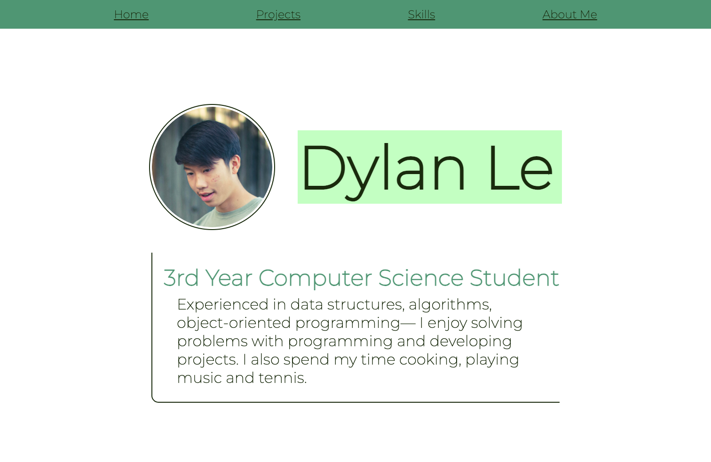

# Ouroboros — Diamond Hacks 3.0 — Closed-Loop QA Automation

An autonomous QA testing system where three parallel AI agents find bugs in a live web app and another AI agent fixes them, in a closed loop until all issues are resolved.

```
  BrowserUse ×3 (finds bugs) --> bug_report_N.json --> Claude Code (fixes bugs)
         ^                                                      |
         |                                                      |
         +---------------------- loop.py -----------------------+
```

## Screenshot



*The BrowserUse agent navigates to the live page, highlights the detected bug with a red border in the DOM, and saves a screenshot to the workspace before downloading it locally.*

## How It Works

1. **Three BrowserUse agents** run in parallel (via `asyncio.gather`), each targeting a different route via its own Cloudflare tunnel
2. Each agent runs a **two-pass audit**: first a recon pass to gather structured page context (using a Pydantic output schema), then a targeted audit pass using that context
3. Bugs are highlighted with a red 3px DOM border, screenshots are captured mid-session and downloaded from the **BrowserUse workspace** to `qa/screenshots/agent_N/`
4. Each agent writes a `bug_report_N.json` to its workspace; the orchestrator downloads it
5. **Claude Code** reads each bug report and applies a surgical fix to the affected source file
6. **loop.py** rechecks, resets state, and runs the next iteration until all bugs are resolved

Each bug is processed individually — never batched. Bugs carry a `route` field that constrains which source files Claude Code is allowed to edit.

## BrowserUse Features Used

| Feature | How it's used |
|---------|--------------|
| **`AsyncBrowserUse` client** | Async Python SDK client (`browser_use_sdk.v3`) — all agent calls are `await`ed |
| **`client.run(task, model, output_schema)`** | Runs a task in a cloud browser session; `output_schema` enforces a Pydantic model on the first pass |
| **Workspaces** — `create` / `files` / `download` / `delete` | Each agent gets an isolated workspace; screenshots and `bug_report.json` are stored there and downloaded to disk, then the workspace is cleaned up |
| **Structured output (Pydantic)** | Pass 1 uses `output_schema=PageContext` to get a typed recon summary (page type, risk areas, suggested QA checks, etc.) |
| **Parallel execution** | `asyncio.gather(*tasks)` runs all three agents concurrently — one per route |
| **Model selection** | `model="gemini-3-flash"` passed directly to `client.run()` |
| **Tunnel management** | `browser-use tunnel <port>` starts Cloudflare tunnels; `browser-use tunnel list` reads back URLs; ngrok fallback if CLI unavailable |
| **DOM manipulation** | Agent injects `element.style.border = '3px solid red'` via JavaScript before taking each bug screenshot |
| **Screenshot capture** | Agent calls workspace screenshot commands during the audit; all `.png` files are listed with `client.workspaces.files()` and downloaded |

## Project Structure

```
.
├── testing-bu-scr.png               # Screenshot: BrowserUse agent highlighting a bug
├── CLAUDE.md                        # Project guidance for Claude Code
├── .claude/
│   ├── commands/run-qa.md           # /run-qa slash command definition
│   └── settings.local.json          # Permission allowlist
├── .agents/skills/browser-use/      # BrowserUse CLI skill docs
│   ├── SKILL.md                     # Full CLI reference (40+ commands)
│   └── references/
│       ├── cdp-python.md            # Low-level CDP & Python session control
│       └── multi-session.md         # Multi-browser session guide
├── qa/
│   ├── run_qa.py                    # Parallel 3-agent BrowserUse orchestrator
│   ├── loop.py                      # Auto-fix orchestrator (closed-loop engine)
│   ├── format_report.py             # Human-readable bug report formatter
│   ├── bug_report_0.json            # Per-agent bug reports (0 = /billing)
│   ├── bug_report_1.json            #                        (1 = /settings)
│   ├── bug_report_2.json            #                        (2 = /profile)
│   ├── screenshots/                 # Downloaded workspace screenshots
│   │   ├── agent_0/                 #   Screenshots from /billing agent
│   │   ├── agent_1/                 #   Screenshots from /settings agent
│   │   └── agent_2/                 #   Screenshots from /profile agent
│   └── .env                         # BROWSER_USE_API_KEY
└── qa-sandbox/                      # React + Vite test application (target)
    ├── src/pages/Dashboard.jsx      # / route
    ├── src/pages/FeedbackForm.jsx   # /form route
    ├── src/pages/Billing.jsx        # /billing route
    ├── src/pages/Settings.jsx       # /settings route
    ├── src/pages/Profile.jsx        # /profile route
    └── src/pages/About.jsx          # /about route
```

## Prerequisites

- **Node.js** (for the qa-sandbox frontend)
- **Python 3.11+** with a virtual environment at `.venv/`
- **BrowserUse CLI** (`browser-use` command available on PATH)
- **BrowserUse SDK v3** (`browser_use_sdk` Python package)
- **Claude Code CLI** (`claude` command)
- **A `BROWSER_USE_API_KEY`** set in `qa/.env`

## Quick Start

### 1. Install dependencies

```bash
# Frontend
cd qa-sandbox && npm install && cd ..

# Python (create venv if needed)
python -m venv .venv
source .venv/Scripts/activate    # Windows
# source .venv/bin/activate      # macOS/Linux
pip install browser-use-sdk rich
```

### 2. Set your API key

```bash
# qa/.env
BROWSER_USE_API_KEY=your_key_here
```

### 3. Run the QA loop

Use the `/run-qa` slash command in Claude Code, or run manually:

```bash
# Start the dev server
cd qa-sandbox && npm run dev -- --host --port 3000 &

# Run all 3 parallel QA agents (tunnels are started automatically)
cd qa && python run_qa.py

# Run the closed-loop fix orchestrator for one agent's report
python loop.py <tunnel_url> bug_report_0.json
```

## Commands

### Frontend (from `qa-sandbox/`)

| Command | Description |
|---------|-------------|
| `npm run dev` | Start dev server on port 3000 |
| `npm run build` | Production build |
| `npm run lint` | ESLint |
| `npm run preview` | Preview production build |

### QA Scripts

| Command | Description |
|---------|-------------|
| `python qa/run_qa.py` | Start 3 parallel BrowserUse agents (tunnels auto-created) |
| `python qa/loop.py <tunnel_url> <report.json>` | Run the full closed-loop orchestrator |
| `python qa/format_report.py <report.json>` | Print a human-readable bug summary |

### Tunnel Management

| Command | Description |
|---------|-------------|
| `browser-use tunnel <port>` | Start a Cloudflare tunnel |
| `browser-use tunnel list` | List active tunnels |
| `browser-use tunnel stop --all` | Stop all tunnels |

## The `/run-qa` Command

The `/run-qa` slash command (defined in `.claude/commands/run-qa.md`) orchestrates the full workflow:

**Phase 1 — Environment Setup**
- Activate `.venv`
- Start dev server if not running
- Start or reuse Cloudflare tunnels

**Phase 2 — Bug Fix Loop** (one bug at a time)
1. Run `run_qa.py` to launch 3 parallel agents and collect reports + screenshots
2. Read each `bug_report_N.json` and present the bug to the user
3. Apply a surgical fix to the affected source file
4. Run `loop.py` to recheck for remaining bugs
5. Repeat until all bugs are resolved

**Phase 3 — Cleanup**
- Kill dev server and tunnel processes

## Two-Pass QA Architecture

Each agent in `run_qa.py` performs a two-pass audit of its assigned route:

**Pass 1 — Recon (structured output)**

```python
context_result = await client.run(
    task=context_task,
    model="gemini-3-flash",
    output_schema=PageContext,   # Pydantic model — enforces typed JSON output
)
```

The `PageContext` schema captures: `page_type`, `primary_user_goal`, `page_summary`, `visible_sections`, `interactive_elements`, `likely_risk_areas`, and `suggested_manual_qa_checks`.

**Pass 2 — Targeted audit (uses Pass 1 context)**

```python
audit_result = await client.run(
    task=audit_task,             # Task prompt includes all PageContext fields
    model="gemini-3-flash",
    workspace_id=workspace.id,   # Agent stores screenshots + bug_report.json here
)
```

After the audit, all `.png` files are listed from the workspace and downloaded to `qa/screenshots/agent_N/`:

```python
files = await client.workspaces.files(workspace.id)
for f in files.files:
    if f.path.endswith(".png"):
        await client.workspaces.download(workspace.id, f.path, to=os.path.join(screenshot_dir, f.path))
```

## Bug Report Format

Each `bug_report_N.json` follows this schema:

```json
{
  "id": "BUG-001",
  "route": "/billing",
  "selector": "div.card (Usage Statistics)",
  "tagName": "DIV",
  "description": "Usage Statistics card overlaps the Subscription Plan card.",
  "category": "Visual",
  "severity": "High",
  "fixed": false
}
```

| Field | Description |
|-------|-------------|
| `id` | Unique identifier (`BUG-NNN`) |
| `route` | Target page route (`/billing`, `/settings`, `/profile`) |
| `selector` | CSS selector or element description |
| `tagName` | HTML tag type (`DIV`, `BUTTON`, `SPAN`, etc.) |
| `description` | Human-readable bug description |
| `category` | `Visual` / `Functional` / `UX` / `Functional/UX` |
| `severity` | `High` / `Medium` / `Low` |
| `fixed` | Boolean — set by BrowserUse, reset by loop.py for re-verification |

## Route-to-File Mapping

Bugs are scoped to specific source files based on their route:

| Route | Source Files |
|-------|-------------|
| `/billing` | `qa-sandbox/src/pages/Billing.jsx`, `Billing.css` |
| `/settings` | `qa-sandbox/src/pages/Settings.jsx`, `Settings.css` |
| `/profile` | `qa-sandbox/src/pages/Profile.jsx`, `Profile.css` |

Claude Code only edits files mapped to the bug's route — never other files.

## Component Architecture

### run_qa.py — Parallel 3-Agent Orchestrator

- Creates an `AsyncBrowserUse` client and spawns one workspace per agent
- Starts 3 Cloudflare tunnels (with ngrok fallback) — one per route
- Runs `run_single_agent()` for each route concurrently via `asyncio.gather()`
- Each agent: recon pass → targeted audit → download screenshots → download `bug_report.json` → delete workspace
- Prints a consolidated summary table at the end

### loop.py — Closed-Loop Orchestrator

- Reads a `bug_report_N.json`, picks the first unfixed bug
- Calls `run_qa.py` to re-audit with BrowserUse
- Calls `claude -p "..." --allowedTools Edit,Read,Write` to fix the bug
- Loops until all bugs are resolved or 5 iterations are reached
- Rich terminal UI: live status panel, typewriter output, success/failure banners

### format_report.py — Report Display

- Reads a bug report JSON file
- Prints status, affected file, and each bug with severity indicators
- Supports both list and dict report formats

## Constraints

- **Claude is the orchestrator** — it calls `run_qa.py` and `loop.py` at each step
- **Route-aware** — only edit files mapped to the bug's route field
- **Present before fixing** — always read and explain the bug before applying a fix
- **Tunnel URLs are CLI args only** — never written to files
- **Always activate `.venv`** before running Python

## License

MIT
